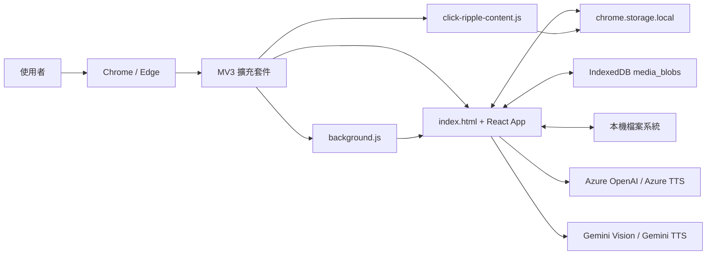
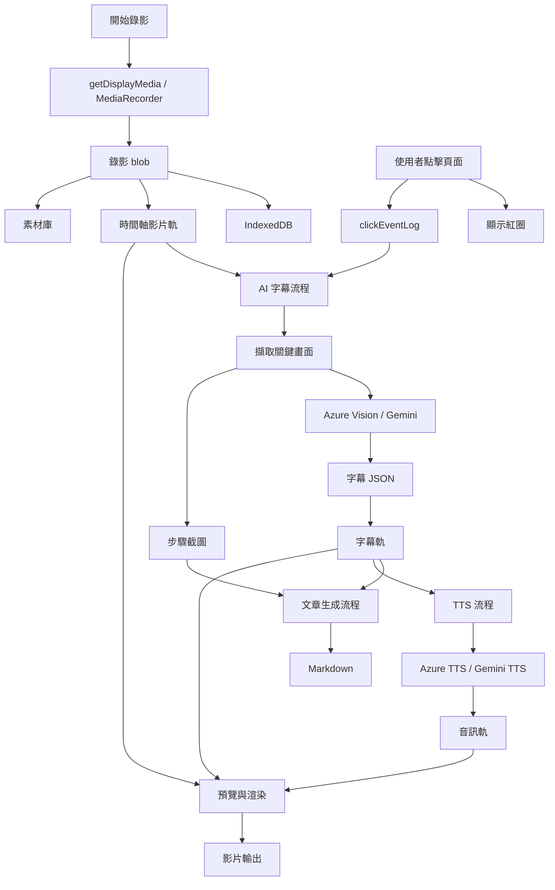

# OpenViscribe

OpenViscribe 是一個建立在 `React + Vite + Tailwind CSS` 上的 Chrome / Edge Manifest V3 擴充套件，定位不是一般網站，而是「瀏覽器內的教學影片工作室」。

它用來錄製操作流程、整理多軌時間軸、建立字幕、生成教學文章與 AI 語音，最後將影片、字幕、文章、素材與專案檔一起匯出。

## 核心價值

- 直接在瀏覽器內錄製操作流程
- 用全域紅色漣漪標記點擊位置與操作節點
- 在時間軸編輯影片、圖片、音訊、字幕與過場
- 用 AI 從畫面與操作步驟生成字幕、文章與語音
- 匯出為可分享、可還原、可再編輯的專案成果

## 主要功能

### 錄影與素材管理

- 支援瀏覽器畫面錄影
- 支援 `1080p / 720p`
- 錄影完成後自動加入素材庫與時間軸
- 媒體素材以 `IndexedDB` 保存，減少重新載入遺失風險

### 點擊追蹤

- 全域紅色漣漪效果
- 記錄點擊位置、時間、點擊文字與頁面資訊
- 可搭配 AI 字幕與 Test Report 對齊互動節點

### 時間軸剪輯

- 3 條影片 / 圖片軌
- 2 條音訊軌
- 2 條字幕軌
- 片段裁切、分割、拖曳、速度調整
- 畫面框拖曳與縮放
- Ken Burns 動畫控制
- 內建過場：
  - `fade`
  - `slide-left`
  - `slide-right`
  - `zoom-in`
  - `wipe-up`

### AI 內容生成

- AI 字幕生成
  - 支援 `Azure OpenAI Vision`
  - 支援 `Gemini`
- 教學文章生成
  - 依字幕、brief 與步驟畫面輸出 Markdown
- AI 自動語音生成
  - 支援 Azure TTS
  - 支援 Gemini TTS
- Test Report
  - 分析 UI、效能、console、network、layout 與部分安全訊號

### 匯入與匯出

- 匯出合成影片 `webm`
- 匯出字幕 `srt`
- 匯出教學文章 `product_article.md`
- 匯出音訊與原始媒體素材
- 匯出 `project.json`
- 匯入 `project.json` 後可從 IndexedDB 或匯出資料夾重新連結媒體

## 適合的使用情境

- SaaS 後台操作教學
- 路由器 / NAS / 設備管理頁教學
- 產品 FAQ 影片製作
- 內部系統操作文件與影片同步產出
- UI 問題重現與 Test Report 蒐證

## 技術堆疊

- `React 18`
- `Vite 5`
- `Tailwind CSS 3`
- `lucide-react`
- `Chrome Extension Manifest V3`

瀏覽器 API 與本機能力：

- `chrome.storage.local`
- `chrome.scripting`
- `MediaRecorder`
- `getDisplayMedia`
- `IndexedDB`
- `showDirectoryPicker`
- `canvas.captureStream`

## 快速開始

### 1. 安裝依賴

```bash
npm install
```

### 2. 本地開發

```bash
npm run dev
```

### 3. 建置擴充套件

```bash
npm run build
```

建置輸出會放在 `dist/`。

### 4. 打包 zip

```bash
./build.sh
```

這會執行：

1. `vite build`
2. 將 `dist/*` 打包成 `extension.zip`

### 5. 載入到 Chrome / Edge

1. 開啟 `chrome://extensions` 或 `edge://extensions`
2. 開啟「開發人員模式」
3. 點選「載入未封裝項目」
4. 選擇本專案資料夾
5. 點擊擴充套件圖示，打開工作室

## 典型工作流程

### 1. 錄製操作

1. 點右上角「開始錄影」
2. 選擇要錄製的瀏覽器分頁
3. 如有開啟全域紅圈，所有點擊都會同步記錄
4. 停止錄影後，影片會自動加入第一條影片軌與素材庫

### 2. 生成 AI 字幕

1. 完成錄影
2. 輸入 brief 或背景說明
3. 點「AI字幕」
4. 系統會：
   - 讀取錄影期間的點擊事件
   - 從影片擷取關鍵畫面
   - 過濾模糊與 loading 畫面
   - 將畫面送到 Azure Vision 或 Gemini
   - 回填字幕到字幕軌
   - 保留步驟截圖供文章生成使用

### 3. 生成文章

1. 完成 AI 字幕
2. 點「生成文章」
3. 系統根據 brief、字幕與步驟截圖輸出 `Markdown`

### 4. 生成語音

1. 準備好字幕
2. 點「AI 自動語音生成」
3. 系統逐段呼叫 TTS API
4. 生成音訊後自動放入音訊軌

### 5. 匯出成果

可選擇輸出：

- 合成影片
- 原始媒體素材
- Markdown 文章
- 音訊
- 字幕 SRT
- `project.json`

若瀏覽器支援 `showDirectoryPicker`，可直接寫入指定資料夾；否則改用瀏覽器下載。

## Codex + Computer Use 自動教學產線

OpenViscribe 可透過本機 Automation API 接收「使用者操作腳本」。Codex 先用 Computer Use 實際操作目標網站或產品介面，OpenViscribe 同步錄製並記錄每一步；完成後再依序生成 AI 字幕、動態 Intro / Outro / Lower Third、教學文章與匯出檔案。

錄影來源選擇和最終輸出資料夾仍由使用者在瀏覽器確認一次。腳本模式只接受真實畫面擷取，不會在權限失敗時自動改成模擬影片。詳細的本機 API、MCP 與腳本格式請見 [automation-api/README.md](automation-api/README.md)。

## Codex 自動化 API

OpenViscribe 內建可供 Codex 排程的本機 Automation API。它可以建立專案、要求開始或停止錄影、生成字幕與文章、套用動態設計並啟動匯出；瀏覽器的錄製來源與輸出資料夾仍由使用者確認。

1. 使用固定 token 啟動本機 API：`OPEN_VISCRIBE_API_TOKEN="your-token" npm run automation:api`
2. 在 OpenViscribe「設定」啟用「允許 Codex 工作流控制」。
3. 依 [automation-api/README.md](automation-api/README.md) 將 `automation-api/mcp.config.example.json` 加入 Codex MCP 設定。

API 服務不會讀取或保存你的 AI 金鑰；實際 AI 呼叫仍在已設定金鑰的瀏覽器 Studio 中進行。

## 系統架構

### 元件分工

- `index.html + React App`
  - 工作室主介面
- `background.js`
  - 開啟工作室、處理擴充套件背景行為
- `click-ripple-content.js`
  - 注入頁面、顯示紅色漣漪並收集點擊資料
- `chrome.storage.local`
  - 保存點擊事件與部分設定
- `IndexedDB`
  - 保存影片、圖片、音訊 Blob

### 架構圖



### 資料流



## 專案結構

### 根目錄

- `package.json`
  - 專案腳本與依賴
- `vite.config.js`
  - Vite 建置設定
- `tailwind.config.js`
  - Tailwind 掃描設定
- `postcss.config.js`
  - PostCSS 設定
- `index.html`
  - 擴充套件工作室入口
- `build.sh`
  - 建置並打包 zip
- `readme.md`
  - 專案說明
- `prompt.md`
  - 重建專案的高保真提示文件

### `src/`

- `src/main.jsx`
  - React 入口
- `src/App.jsx`
  - 專案主要邏輯與 UI
  - 包含：
    - 設定管理
    - 錄影
    - 時間軸編輯
    - 字幕處理
    - 過場與 Ken Burns
    - AI 字幕 / 文章 / 語音
    - Test Report
    - 匯入 / 匯出 / 還原
- `src/index.css`
  - 全域樣式

### `public/`

- `public/manifest.json`
  - 擴充套件 Manifest V3 設定
- `public/background.js`
  - 開啟工作室與背景控制
- `public/click-ripple-content.js`
  - 點擊紅圈效果與事件記錄

## 主要資料模型

`projectState` 主要包含：

- `tracks`
  - 3 條影片 / 圖片軌
- `videoTransitions`
  - 3 條影片過場軌
- `audioTracks`
  - 2 條音訊軌
- `subtitles`
  - 字幕清單
- `subtitleTransitions`
  - 字幕過場
- `assets`
  - 素材庫
- `tutorialDescription`
  - 使用者輸入的 brief
- `tutorialMD`
  - 生成後的教學文章
- `uiDebugMD`
  - Test Report Markdown
- `capturedFrames`
  - AI 字幕分析後保留的畫面資料
- `uiDebugFrames`
  - Test Report 使用的截圖資料
- `recordingRange`
  - 本次錄影對應的絕對時間範圍

## 儲存策略

- `localStorage`
  - `extension_settings`
  - `wilson_project_draft`
- `chrome.storage.local`
  - `clickRippleEnabled`
  - `clickRippleSessionId`
  - `clickEventLog`
- `IndexedDB`
  - `WilsonEditorDB / media_blobs`
  - 儲存影片、圖片、音訊 Blob

## AI 串接

### Azure 模式

- Vision / 文章：
  - `chat/completions`
- TTS：
  - `audio/speech`
- STT：
  - `audio/transcriptions`

需要的設定：

- Vision Endpoint
- TTS Endpoint
- Vision API Key
- TTS API Key
- STT API Key
- Vision Deployment 名稱
- TTS Deployment 名稱
- STT Deployment 名稱

### Gemini 模式

- Vision / 文章：
  - `generateContent`
- TTS：
  - `gemini-2.5-flash-preview-tts:generateContent`

需要的設定：

- API Key
- Model 名稱

### Ollama 模式規劃

目前設定介面已預留 `Ollama` provider，適合後續接本地或內網 AI server。

建議不要只用單一模型處理所有工作，而是分成：

- Vision 模型
  - 負責 UI 畫面理解、OCR、步驟抽取
- Chat / Text 模型
  - 負責文章生成、字幕整理、FAQ 改寫、JSON 結構輸出
- STT 服務
  - 負責旁白轉字幕
- TTS 服務
  - 負責語音生成

建議組合：

- 入門實用版
  - Vision：`qwen2.5vl:7b`
  - Chat：`qwen3:8b`
  - STT：`faster-whisper`
  - TTS：`Piper` 或 `Kokoro`
- 品質優先版
  - Vision：`qwen2.5vl:32b`
  - Chat：`qwen3:14b`
  - STT：`faster-whisper large-v3`
  - TTS：`Kokoro`
- 輕量備選
  - Vision / Text：`gemma3:4b`
  - 適合開發測試或低硬體環境

模型選型建議：

- `qwen2.5vl`
  - 最適合這個專案目前的 UI 畫面理解、圖內文字辨識與步驟抽取
- `qwen3`
  - 適合多語文章生成、步驟整理與結構化輸出
- `gemma3`
  - 適合作為較輕量的多語文字模型備選
- `llama3.2-vision`
  - 不建議當主力多語 Vision 模型，因為 image + text 場景以英文支援為主

### Ollama 硬體建議

依 OpenViscribe 的使用情境，硬體需求會受 Vision 模型大小影響很大。

最低可用：

- CPU：8 核以上
- RAM：`32GB`
- SSD：`150GB`
- 適合模型：
  - `qwen2.5vl:7b`
  - `qwen3:8b`
  - `gemma3:4b`

比較舒服：

- CPU：12 核以上
- RAM：`64GB`
- SSD：`500GB`
- 適合模型：
  - `qwen2.5vl:7b`
  - `qwen3:14b`
  - `gemma3:12b`

正式長期使用：

- CPU：12 到 16 核
- RAM：`64GB ~ 128GB`
- SSD：`1TB`
- 適合：
  - 保留多組模型
  - 同時存放素材、截圖、匯出結果
  - 提供多人共用或批次工作流程

桌機 / 小主機參考：

- `Beelink SER9 32GB`
  - 甜 spot 約在 `7B ~ 14B`
  - 適合 `qwen2.5vl:7b + qwen3:8b`
- `Mac mini M4 16GB`
  - 甜 spot 約在 `4B ~ 8B`
  - 適合 `qwen2.5vl:7b + qwen3:4b/8b`

### Ollama 硬碟空間建議

如果 AI server 主要只放模型：

- 最低可用：`80GB`
- 比較舒服：`150GB`
- 長期不想一直清模型：`300GB`

如果同一台機器也要保存：

- 錄影素材
- 擷取畫面
- 匯出音訊
- 匯出影片
- `project.json`

則建議直接準備：

- `500GB ~ 1TB SSD`

## 已知限制

- 最終合成影片目前輸出為 `webm`，未提供原生 `mp4` 封裝
- 專案核心邏輯仍主要集中在 `src/App.jsx`
- AI API 呼叫目前直接在前端進行，正式環境建議改由後端代理
- TTS、Vision、STT 的成本、限流與權限控管尚未做企業級保護
- Ollama 設定介面已預留，但實際推論流程仍以 Azure / Gemini 為主

## 建議下一步

1. 將 `src/App.jsx` 拆成：
   - editor state
   - AI services
   - export services
   - timeline components
2. 將 AI 呼叫搬到後端服務
3. 增加設定驗證、錯誤重試與更完整的狀態提示
4. 補測試：
   - timeline 邏輯
   - subtitle normalization
   - import / export
   - AI payload builder

## 授權與備註

目前 repo 內未另外標示授權條款；若要對外發佈，建議補上 LICENSE 與第三方模型 / API 使用說明。
