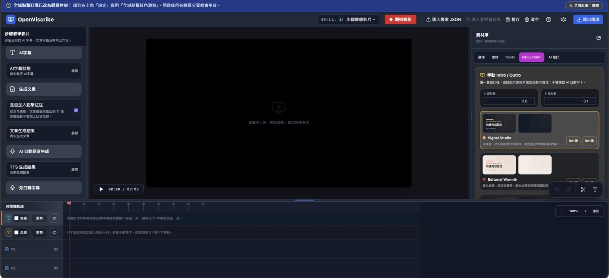
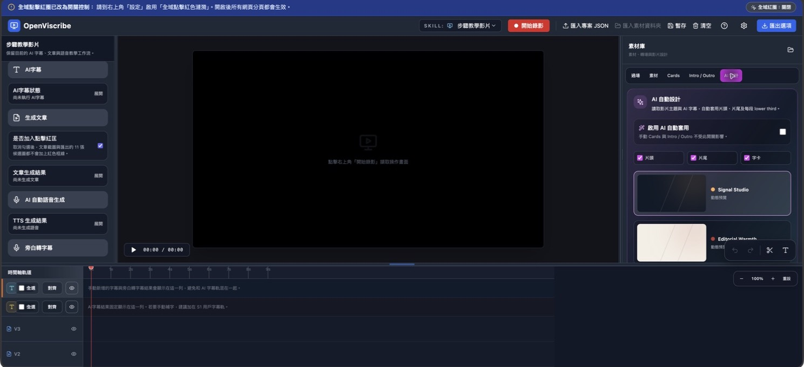
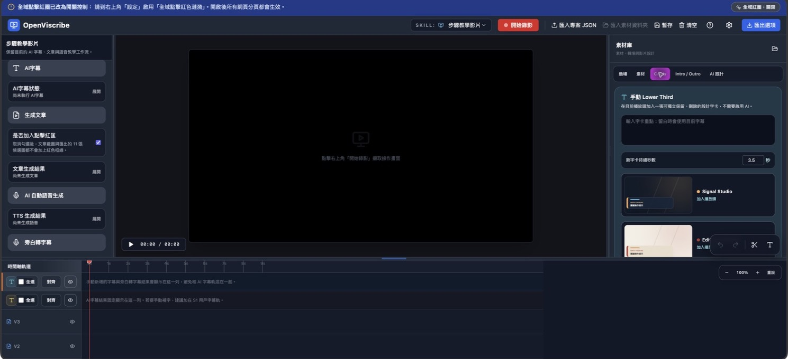

# OpenViscribe

> 把「操作一遍」變成可編輯的教學影片、字幕、文章與語音。

OpenViscribe 是一套以 Chrome / Edge Manifest V3 擴充套件形式運作的瀏覽器內教學製作工作室。它從螢幕錄影與點擊操作出發，將素材放進多軌時間軸，並可透過 AI 產生字幕、教學文章、旁白與動態設計；最後一次匯出影片、SRT、Markdown、音訊和可再編輯的專案檔。



## 為什麼使用 OpenViscribe？

- **錄一次，產出多種內容**：影片、字幕、文章、語音與專案素材一起完成。
- **保留操作脈絡**：可記錄點擊位置與目標，將重要步驟標記到文章截圖。
- **不只剪片**：內建影片、圖片、音訊、字幕與過場的多軌時間軸。
- **AI 可替換**：支援 Azure OpenAI、Gemini、LM Studio 與 Ollama 設定。
- **在瀏覽器本機運作**：媒體 Blob 儲存在 IndexedDB；專案可匯出、匯入與重新連結素材。

## 介面一覽

| 工作室 | 影片動態設計 |
| --- | --- |
| 多軌時間軸、AI 工作流與素材庫集中在一個畫面。 | 可依影片主題與字幕套用片頭、片尾及 lower third。 |
|  |  |

### 動態字卡庫

手動 lower third 可挑選設計套件、輸入文字並直接加入時間軸。



## 適合的情境

- SaaS、網站後台或內部系統的操作教學
- 路由器、NAS 與裝置管理介面說明
- 產品 FAQ、功能介紹與客服知識庫
- UI 問題重現、Web 診斷與測試蒐證
- UX 研究：整理任務流程、使用者猶豫與流程摩擦
- 將螢幕錄影、實拍素材和 PIP 畫面混合成教學影片

## 核心能力

| 區塊 | 能力 |
| --- | --- |
| 錄製與點擊 | 瀏覽器畫面錄影、1080p / 720p、全域點擊紅圈、點擊事件與目標位置記錄。 |
| 編輯 | 3 條影片／圖片軌、2 條音訊軌、2 條字幕軌；支援分割、裁切、拖曳、速度、畫面布局、Ken Burns 與過場。 |
| AI 生成 | 從關鍵畫面與點擊步驟生成字幕、Markdown 教學文章、TTS 旁白與語音轉字幕。 |
| 動態設計 | 內建 Signal Studio、Editorial Warmth、Creator Pulse；可加入 Intro、Outro 與 lower third。 |
| 分析模式 | 步驟教學、綜合教學影片、專欄主題、Web 診斷、UX 研究。 |
| 匯入／匯出 | 匯出 WebM、SRT、Markdown、音訊、原始素材和 `project.json`；可再匯入專案並重連媒體。 |

## 快速開始

### 需求

- Chrome 或 Microsoft Edge（支援 Manifest V3）
- Node.js 18 以上

### 安裝與建置

```bash
npm install
npm run build
```

建置完成後會產生 `dist/`。若要同時打包成 zip：

```bash
./build.sh
```

### 載入擴充套件

1. 開啟 `chrome://extensions` 或 `edge://extensions`。
2. 啟用「開發人員模式」。
3. 點選「載入未封裝項目」。
4. 選擇本專案的 `dist/` 資料夾。
5. 點選 OpenViscribe 圖示，開啟工作室。

開發時可使用：

```bash
npm run dev
```

## 建議工作流程

```text
錄製操作 → 整理時間軸 → AI 字幕 → 文章／旁白 → 動態設計 → 預覽與匯出
```

1. **錄製**：按「開始錄影」，在瀏覽器分享視窗選擇要擷取的分頁或視窗。
2. **標記操作**：在設定中開啟全域點擊紅圈；錄製時會保存點擊位置與介面目標，供文章截圖標示使用。
3. **生成字幕**：填入文章主題或 brief，按「AI 字幕」。系統會擷取品質較佳的關鍵畫面、結合操作事件後回填字幕軌。
4. **產出內容**：按「生成文章」建立 Markdown；需要旁白時按「AI 自動語音生成」，音訊會自動放入時間軸。
5. **設計影片**：從素材庫加入過場、Cards、片頭／片尾，或使用「AI 設計」套用整套動態樣式。
6. **匯出**：在匯出選項選擇影片、SRT、文章、音訊、素材與 `project.json`。

## AI 服務設定

在右上角「設定」中可分別選擇每項工作的供應商：

- **Azure OpenAI**：Vision、Chat、TTS、STT 可各自填入 Endpoint、Deployment 與 API Key。
- **Gemini**：用於畫面理解、文字與 TTS。
- **LM Studio / Ollama**：適合本機或內網模型服務；可分別指定 Vision、Chat、TTS、STT 模型與端點。

金鑰設定保留在瀏覽器工作室內。若使用本機 Automation API，API 不會讀取或保存 AI 金鑰。

## Codex 自動化工作流（可選）

OpenViscribe 可由本機 Automation API 排程專案、錄製、AI 生成、動態設計與匯出。瀏覽器的錄製來源和最終輸出位置仍會由使用者確認。

```bash
OPEN_VISCRIBE_API_TOKEN="your-stable-token" npm run automation:api
```

接著到 OpenViscribe「設定」啟用「允許 Codex 工作流控制」，並填入相同 token。完整 API、MCP 設定與互動腳本格式請見 [automation-api/README.md](automation-api/README.md)。

### Contents 樣板與自然語言設計

素材庫新增 **Contents** 分頁，提供 15 個可動態預覽並直接加入播放頭的素材：世界地圖、全球流向、資料圖表、流程圖、終端機、程式碼差異、程式碼打字、應用程式展示、手機裝置、Liquid Glass、社群追蹤卡、新聞跑馬燈、關鍵字字幕、霓虹程式碼與版本路線圖；另保留產品教學、編輯敘事、創作者 CTA、開發者版本說明與功能發表等整套樣板。每個項目都標示對應的 HyperFrames Catalog block 與使用理由。

透過 MCP 的 Agent 可先呼叫 `openviscribe_list_hyperframe_templates` 或 `openviscribe_list_hyperframe_assets`，再依「做一支有世界地圖與 console 的部署教學」這種自然語言請求提出可比較的素材；使用者確認後以 `openviscribe_apply_hyperframe_template` 或 `openviscribe_add_hyperframe_asset` 套用。若要更自動化，可用 `openviscribe_auto_add_contents` 或在整體工作流開啟 `autoContents`，系統最多挑選兩個有敘事理由的 Contents。這些素材會寫入專案設定並隨影片輸出，而不是僅回傳文字建議。

## 資料與隱私

- 媒體 Blob 儲存在瀏覽器的 IndexedDB，避免重新載入後遺失。
- 點擊事件和部分設定使用 `chrome.storage.local`／`localStorage`。
- 若選擇雲端 AI，只有進行對應生成任務時才會將必要畫面、文字或音訊送至你設定的服務。
- `project.json` 可保存專案結構；媒體可從 IndexedDB 或匯出的資料夾重新連結。

## 技術堆疊

- React 18、Vite 5、Tailwind CSS 3
- Chrome Extension Manifest V3
- `MediaRecorder`、`getDisplayMedia`、`canvas.captureStream`
- `IndexedDB`、`chrome.storage.local`、`chrome.scripting`

## 已知限制

- 影片合成目前輸出為 WebM，尚未提供原生 MP4 封裝。
- AI 功能需要自行設定相應供應商的有效金鑰與模型。
- 錄影來源、螢幕分享權限與最終輸出位置會由瀏覽器要求確認。

## 授權

本專案採用 [MIT License](LICENSE)。
